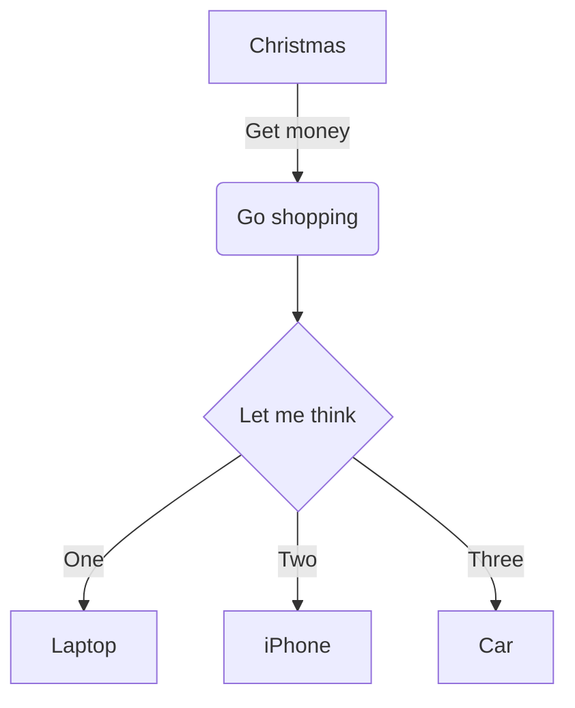

# Simple example

```
npm i
npm start
```

Then this documentation will be rendered by [@diplodoc/transform](https://github.com/diplodoc-platform/transform) and opened in your default browser.

## Diagram

